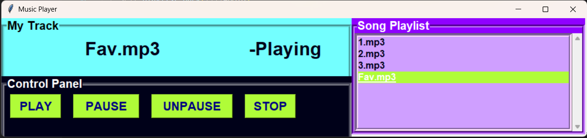

# 🎵 Music Player in Python

A simple music player developed using **Python**, **Tkinter**, and **Pygame**. This project includes both a Command-Line Interface (CLI) version and a Graphical User Interface (GUI) version.

---

## 📸 GUI Preview

<p align="center">
  
</p>

---

## 📂 Project Structure

```text
Music_Player_python/
│
│── Version1_cli/
│   └── music_player.py
│
│── Version2_gui/
    └── assets/
│       └── gui.png
│   └── music_player.py
│
└── README.md
```

## ✨ Features

### Version 1 (CLI)

- ▶️ Play music
- ⏸️ Pause & Resume
- ⏹️ Stop playback

### Version 2 (GUI)

- 🎵 Playlist
- ▶️ Play
- ⏸️ Pause
- ▶️ Resume
- ⏹️ Stop
- 🖥️ Tkinter GUI
- 📃 Displays current song

## 🛠️ Requirements

- Python 3.x
- Pygame

```bash
pip install pygame
```

## ▶️ Run

CLI Version

```bash
cd Version1_cli
python music_player.py
```

GUI Version

```bash
cd Version2_gui
python music_player.py
```

## 📄 License

This project is open source and created for learning purposes.
